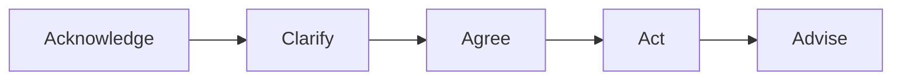

# Kundenkommunikation

Hier findest du alles zu professioneller Kommunikation im Support: Gesprächsstruktur, Deeskalation und bewährte Kommunikationsmodelle. Mit konkreten Dialogbeispielen für typische Situationen.

---

## Das Wichtigste

- **Service-Mindset:** Empathie + Klarheit + Verbindlichkeit
- **Gesprächsstruktur:** Acknowledge → Clarify → Agree → Act → Advise
- **Deeskalation:** Zuhören, Verständnis zeigen, Lösung anbieten
- **GFK (4 Schritte):** Beobachtung → Gefühl → Bedürfnis → Bitte
- **4-Ohren-Modell:** Jede Nachricht hat 4 Seiten (Sachinhalt, Appell, Beziehung, Selbstoffenbarung)

---

## Die drei Säulen guter Kommunikation

### 1. Empathie

- Versetze dich in die Lage des Users
- Anerkenne die Frustration, ohne sie zu verstärken
- „Ich verstehe, dass das frustrierend ist"

### 2. Klarheit

- Vermeide IT-Jargon oder erkläre ihn
- Sag klar, was du tust und warum
- Gib realistische Zeitangaben

### 3. Verbindlichkeit

- Halte Zusagen ein
- Wenn es länger dauert: proaktiv informieren
- Schließe jeden Kontakt mit nächstem Schritt ab

---

## Gesprächsstruktur in 5 Schritten

### Die 5 Schritte im Detail

| Schritt | Was tun | Beispielsatz |
|---------|---------|--------------|
| **Acknowledge** | Problem annehmen, Verständnis zeigen | „Ich verstehe, das ist ärgerlich. Ich kümmere mich darum." |
| **Clarify** | Rückfragen stellen, Problem verstehen | „Seit wann tritt das auf? Gibt es eine Fehlermeldung?" |
| **Agree** | Erwartungen abstimmen, nächste Schritte klären | „Ich schaue mir das jetzt an. In 30 Minuten melde ich mich." |
| **Act** | Problem bearbeiten, lösen oder eskalieren | [Troubleshooting durchführen] |
| **Advise** | Ergebnis mitteilen, Prävention, Follow-up | „Das Problem ist gelöst. Falls es wieder auftritt, melden Sie sich." |

---

## Deeskalation in 60 Sekunden

Wenn ein User verärgert ist, folge diesem Ablauf:

| Zeit | Phase | Was tun |
|------|-------|---------|
| **0-20 Sek.** | Zuhören | Nicht unterbrechen. Kurze Bestätigungen: „Ja", „Ich verstehe" |
| **20-40 Sek.** | Verstehen zeigen | „Das klingt wirklich frustrierend." / „Ich kann nachvollziehen, dass Sie ärgerlich sind." |
| **40-60 Sek.** | Lösung anbieten | „Lassen Sie mich schauen, wie ich Ihnen helfen kann." / „Ich kümmere mich sofort darum." |

### Deeskalations-Phrasen

| Situation | So NICHT | Besser so |
|-----------|----------|-----------|
| User ist sauer | „Beruhigen Sie sich mal." | „Ich verstehe Ihre Frustration." |
| Problem unklar | „Das haben Sie mir nicht gesagt." | „Lassen Sie mich noch mal nachfragen." |
| Kann nicht sofort lösen | „Da kann ich nichts machen." | „Das braucht etwas Zeit. Ich melde mich in X." |
| War nicht mein Fehler | „Das war nicht ich." | „Das tut mir leid. Ich schaue, wie ich helfen kann." |

---

## Aktives Zuhören

### 3 Komponenten

1. **Paraphrasieren:** Wiederhole das Gehörte in eigenen Worten
   - „Wenn ich Sie richtig verstehe, können Sie seit heute Morgen nicht drucken?"

2. **Gefühle spiegeln:** Benenne die Emotion
   - „Das klingt frustrierend, besonders wenn Sie eine Deadline haben."

3. **Nachfragen:** Zeige echtes Interesse
   - „Können Sie mir mehr dazu sagen? Was haben Sie schon versucht?"

### Wann einsetzen?

- Bei jedem Erstkontakt
- Bei unklaren Anfragen
- Bei emotionalen Usern

---

## Gewaltfreie Kommunikation

Die 4 Schritte nach Marshall Rosenberg:

| Schritt | Frage | Beispiel |
|---------|-------|----------|
| **1. Beobachtung** | Was sehe/höre ich konkret? | „Ich sehe, dass Ihre Anfrage seit 3 Tagen offen ist." |
| **2. Gefühl** | Wie fühle ich mich dabei? | „Das ist mir unangenehm." |
| **3. Bedürfnis** | Was brauche ich? | „Mir ist wichtig, dass Sie eine schnelle Lösung bekommen." |
| **4. Bitte** | Konkrete Handlung, die ich mir wünsche | „Können wir jetzt gemeinsam das Problem durchgehen?" |

### Beispiel: User beschwert sich

**User:** „Nie funktioniert hier irgendwas! Das ist doch eine Zumutung!"

**GFK-Antwort:**

- **Beobachtung:** „Ich höre, dass Sie mehrfach Probleme hatten."
- **Gefühl/Empathie:** „Das ist verständlicherweise frustrierend."
- **Bedürfnis:** „Mir ist wichtig, dass Sie zuverlässig arbeiten können."
- **Bitte:** „Können Sie mir das aktuelle Problem beschreiben, damit ich es lösen kann?"

---

## Vier-Ohren-Modell

Jede Nachricht hat 4 Seiten – als Sender und Empfänger:

| Seite | Bedeutung |
|-------|-----------|
| **Sachinhalt** | Worüber informiere ich? |
| **Selbstoffenbarung** | Was sage ich über mich selbst? |
| **Beziehung** | Wie stehe ich zum anderen? |
| **Appell** | Was soll der andere tun? |

### Beispiel: „Der Drucker geht schon wieder nicht!"

| Ohr | Was könnte gemeint sein? |
|-----|-------------------------|
| **Sachinhalt** | Drucker funktioniert nicht |
| **Appell** | Repariere das! / Hilf mir! |
| **Beziehung** | Ihr (IT) macht euren Job nicht richtig |
| **Selbstoffenbarung** | Ich bin gestresst / unter Druck |

### Praxis-Tipp

Reagiere auf das **Beziehungs-** und **Selbstoffenbarungs-Ohr** bevor du das **Sach-Ohr** bedienst:

- :material-close: „Haben Sie schon neu gestartet?" (nur Sach-Ohr)
- :material-check: „Das ist ärgerlich, wenn man gerade etwas drucken muss. Ich schaue mir das sofort an." (erst Beziehung, dann Sache)

---

## Erwartungen managen und Grenzen setzen

### Erwartungen managen

| Situation | Technik |
|-----------|---------|
| Lösung dauert länger | Zeit-Rahmen geben: „Das braucht ca. 30 Minuten" |
| Kann nicht sofort | Nächsten Schritt nennen: „Ich melde mich bis 14 Uhr" |
| Komplexes Problem | Transparenz: „Das ist ein größeres Problem, ich ziehe einen Kollegen hinzu" |

### Grenzen setzen (professionell)

Manchmal musst du „Nein" sagen – aber konstruktiv:

| So NICHT | Besser so |
|----------|-----------|
| „Das ist nicht mein Job." | „Dafür ist Abteilung X zuständig. Ich verbinde Sie/erstelle ein Ticket." |
| „Das geht nicht." | „Das ist technisch nicht möglich, aber wir könnten alternativ..." |
| „Da kann ich nichts machen." | „Das liegt außerhalb meines Einflussbereichs. Ich eskaliere das für Sie." |

---

## Dialogbeispiele

### Dialog 1: Verärgerter User

**Situation:** User ruft zum dritten Mal wegen desselben Problems an.

**User:** „Das ist jetzt das dritte Mal, dass ich anrufe! Kann bei euch niemand ein Problem richtig lösen?"

**Support:** „Ich verstehe Ihre Frustration – dreimal anrufen zu müssen, ist wirklich ärgerlich." *(Acknowledge)*

„Lassen Sie mich Ihr Ticket aufrufen und schauen, was bisher passiert ist. Ich sehe hier die letzten beiden Einträge. Tritt das Problem immer noch genauso auf wie beim ersten Mal?" *(Clarify)*

**User:** „Ja, mein Outlook stürzt jeden Morgen ab!"

**Support:** „Okay, ich verstehe. Das wurde bisher nur temporär gelöst. Ich werde das jetzt eskalieren und sicherstellen, dass wir die Ursache finden. Ich rufe Sie heute bis 16 Uhr zurück mit einem Update. Ist das in Ordnung für Sie?" *(Agree)*

**User:** „Na gut, aber diesmal will ich eine richtige Lösung."

**Support:** „Das verstehe ich. Ich notiere mir, dass es diesmal eine dauerhafte Lösung sein muss. Sie hören heute von mir." *(Advise)*

---

### Dialog 2: VIP-User / Management

**Situation:** Abteilungsleiter meldet sich, weil sein Team nicht arbeiten kann.

**User:** „Hier ist Herr Schmidt, Leiter Vertrieb. Mein komplettes Team kann nicht auf das CRM zugreifen. Wir haben Kundentelefonate!"

**Support:** „Herr Schmidt, das ist kritisch – ich verstehe. Ich kümmere mich sofort darum." *(Acknowledge)*

„Betrifft das alle 12 Mitarbeiter im Vertrieb? Und seit wann genau?" *(Clarify)*

**User:** „Seit etwa 10 Minuten. Alle 12 haben das gleiche Problem."

**Support:** „Verstanden. Das klingt nach einem serverweiten Problem, nicht nach einzelnen Clients. Ich prüfe sofort den CRM-Server und melde mich in 10 Minuten bei Ihnen – oder früher, wenn ich etwas habe. Soll ich Sie direkt zurückrufen oder eine Mail an Sie und Ihr Team schicken?" *(Agree)*

**User:** „Rufen Sie mich an, [Nummer]."

**Support:** „Notiert. In spätestens 10 Minuten hören Sie von mir." *(Advise)*

---

### Dialog 3: Unklare Anforderung

**Situation:** User weiß nicht genau, was er braucht.

**User:** „Ich bräuchte mal irgendwie Zugriff auf die Daten von der Buchhaltung."

**Support:** „Okay, da helfe ich gerne. Können Sie mir etwas mehr erzählen? Um welche Daten geht es genau – sind das Berichte, einzelne Dateien, oder ein bestimmtes System?" *(Clarify)*

**User:** „Hmm, keine Ahnung. Mein Chef meinte, ich soll die Zahlen für die Auswertung holen."

**Support:** „Verstehe. Das klingt nach den Monatsberichten. Die liegen normalerweise auf dem Share \\\\server\\buchhaltung. Haben Sie schon versucht, darauf zuzugreifen?" *(Clarify)*

**User:** „Ja, da steht ‚Zugriff verweigert'."

**Support:** „Okay, dann fehlt Ihnen die Berechtigung. Die kann ich nicht selbst vergeben – das muss Ihr Vorgesetzter bei der Buchhaltungsleitung anfragen. Ich kann aber ein Ticket erstellen und die Anfrage für Sie einleiten. Soll ich das machen?" *(Agree)*

**User:** „Ja, das wäre super."

**Support:** „Erledigt. Die Buchhaltung bekommt die Anfrage, und Sie erhalten eine Bestätigung per Mail. Das dauert erfahrungsgemäß 1-2 Arbeitstage." *(Advise)*

---

## Kommunikation per Videokonferenz

Im Online-Support per Video gelten besondere Regeln:

### Webcam & Blickkontakt

| Aspekt | Empfehlung |
|--------|------------|
| **Blickkontakt** | In die Kamera schauen = Blickkontakt mit dem User |
| **Kameraposition** | Auf Augenhöhe, nicht von unten oder oben |
| **Hintergrund** | Aufgeräumt, neutral, keine Ablenkung |
| **Beleuchtung** | Licht von vorne, nicht von hinten (kein Fenster im Rücken) |

### Stimme & Sprache

- **Deutlicher sprechen** – Mikrofone komprimieren, nuscheln fällt stärker auf
- **Pausen machen** – Verzögerungen durch Technik einplanen
- **Nachfragen** – „Können Sie mich gut hören und sehen?"
- **Langsamer sprechen** – Online wirkt schnelles Reden hektisch

### Bildschirmfreigabe

| Situation | Best Practice |
|-----------|--------------|
| **Problem zeigen** | User teilt Bildschirm, Support schaut zu |
| **Lösung demonstrieren** | Support teilt Bildschirm und erklärt Schritte |
| **Sensible Daten** | Vorher fragen: „Darf ich Ihren Bildschirm sehen?" |
| **Kontrolle übernehmen** | Nur mit ausdrücklicher Erlaubnis (Remote Control) |

---

## Checkliste für jeden Kontakt

### Allgemein

- [ ] User ausreden lassen
- [ ] Problem in eigenen Worten wiederholt (Paraphrasieren)
- [ ] Bei Emotion: erst Verständnis, dann Sachebene
- [ ] Nächsten Schritt genannt
- [ ] Zeitrahmen gegeben (wenn möglich)
- [ ] Ticket/Dokumentation aktualisiert

### Online / Videokonferenz

- [ ] Kamera an, Blick in die Kamera
- [ ] Ton und Bild beim User funktioniert?
- [ ] Bildschirmfreigabe vorbereitet?
- [ ] Backup-Kontaktmöglichkeit (Telefon) ausgetauscht?
- [ ] Deutlich und langsam gesprochen?

