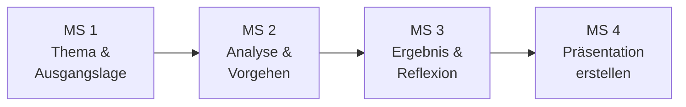

# Meilensteinleitfaden

Dieser Leitfaden begleitet dich in **vier Meilensteinen** von der Themenwahl bis zur fertigen Präsentation. Fülle jeden Meilenstein Schritt für Schritt aus. Wenn du alle vier abgeschlossen hast, bist du bereit für die Prüfung.

| Meilenstein | Inhalt | Aufwand |
|---|---|---|
| **1** – Thema & Ausgangslage | Thema, Zielgruppe, Persona, Problemstellung | ca. 30 Min. |
| **2** – Analyse & Vorgehen | Hypothesen, Schritte, Root Cause, Begründung | ca. 45 Min. |
| **3** – Ergebnis & Reflexion | Ergebnis, Nachweise, Lessons Learned, Fachgespräch | ca. 30 Min. |
| **4** – Präsentation erstellen | Folien bauen, Probeläufe, Technik-Check | ca. 45–60 Min. |

---

## Meilenstein 1: Thema, Zielgruppe & Ausgangslage

!!! info "Ziel"
    Du hast dein Thema gewählt, weißt für wen du präsentierst und kannst die Problemstellung klar beschreiben.

### 1.1 Mein Thema

Wähle ein Thema aus dem [Themenpool](themenpool.md). Es sollte ein realer oder realistischer Supportfall sein.

| | Dein Eintrag |
|---|---|
| **Gewähltes Thema** | |
| **Warum dieses Thema?** (z. B. eigene Erfahrung, Interesse, Praxisbezug) | |

### 1.2 Zielgruppe

!!! warning "Wichtig"
    Die Zielgruppe ist **nicht** der Prüfungsausschuss! Nenne eine konkrete Rolle, z. B. IT-Administratoren, IT-Leitung, Fachabteilungsleiter.

| | Dein Eintrag |
|---|---|
| **Rolle / Position** | |
| **Technisches Vorwissen** | gering / mittel / hoch |
| **Was erwartet diese Person von mir?** | |

### 1.3 Persona – Der/Die Betroffene

Beschreibe die Person, die das Support-Problem hat. Das macht dein Szenario greifbar.

| | Dein Eintrag |
|---|---|
| **Name** (fiktiv) | |
| **Abteilung / Rolle** | |
| **Technisches Niveau** | Einsteiger / Fortgeschritten / Experte |
| **Stimmung / Dringlichkeit** | |

### 1.4 Die Problemstellung

Beschreibe in 2–3 Sätzen, was genau passiert ist:

> _Hier deine Problembeschreibung eintragen …_

| | Dein Eintrag |
|---|---|
| **Wie viele Nutzer betroffen?** | |
| **Auswirkung auf den Betrieb** | |
| **Priorität** | P1 Kritisch / P2 Hoch / P3 Mittel / P4 Niedrig |
| **Begründung der Priorität** | |

??? tip "Erinnerung: Priorität bestimmen"
    Priorität = **Impact** (Auswirkung) × **Urgency** (Dringlichkeit). Mehr dazu unter [Fehleranalyse](troubleshooting.md).

### Selbstcheck Meilenstein 1

- [ ] Ich habe ein konkretes Thema gewählt
- [ ] Meine Zielgruppe ist eine echte Rolle (nicht „Prüfungsausschuss")
- [ ] Ich kann das Problem in 2–3 Sätzen verständlich erklären
- [ ] Die Priorität ist nachvollziehbar begründet

---

## Meilenstein 2: Analyse & Vorgehen

!!! info "Ziel"
    Du dokumentierst deine systematische Fehleranalyse und kannst dein Vorgehen begründen.

### 2.1 Hypothesen

Bevor du loslegst: Was könnten mögliche Ursachen sein? Stelle **mindestens 3** Hypothesen auf.

| # | Hypothese | Wie prüfe ich das? |
|---|---|---|
| 1 | | |
| 2 | | |
| 3 | | |

??? tip "Erinnerung: Hypothesenbasiertes Troubleshooting"
    Stelle zuerst Vermutungen auf, dann prüfe sie gezielt. Nutze die [Fehleranalyse-Methoden](troubleshooting.md) (OSI-Modell, 5-Why, Divide & Conquer).

### 2.2 Mein Vorgehen Schritt für Schritt

Beschreibe deine Schritte mit konkreten Tools und Befehlen.

| Schritt | Was habe ich getan? | Tool / Befehl | Ergebnis |
|---|---|---|---|
| 1 | | | |
| 2 | | | |
| 3 | | | |
| 4 | | | |
| 5 | | | |

### 2.3 Die Ursache (Root Cause)

| | Dein Eintrag |
|---|---|
| **Was war die tatsächliche Ursache?** | |
| **Welche Hypothese hat sich bestätigt?** | |

### 2.4 Entscheidungen begründen

!!! warning "Prüfer fragen immer: Warum genau SO?"
    Du musst deine Lösung begründen können und mindestens eine Alternative kennen.

| | Dein Eintrag |
|---|---|
| **Meine Lösung** | |
| **Warum diese Lösung?** | |

**Welche Alternativen hätte es gegeben?**

| Alternative | Vorteil | Nachteil | Warum nicht gewählt? |
|---|---|---|---|
| | | | |
| | | | |

### 2.5 Kommunikation im Supportfall

| Situation | Was habe ich gesagt/geschrieben? |
|---|---|
| **Erstkontakt** | |
| **Statusupdate** | |
| **Abschluss** | |

??? tip "Erinnerung: Gesprächsstruktur"
    Nutze die ACAAA-Methode: Acknowledge → Clarify → Agree → Act → Advise. Mehr unter [Kundenkommunikation](kommunikation.md).

### Selbstcheck Meilenstein 2

- [ ] Ich habe mindestens 3 Hypothesen aufgestellt
- [ ] Mein Vorgehen ist in konkreten Schritten mit Tools/Befehlen dokumentiert
- [ ] Ich kann meine Lösung begründen und kenne mindestens eine Alternative
- [ ] Ich habe beschrieben, wie ich mit dem Betroffenen kommuniziert habe

---

## Meilenstein 3: Ergebnis, Nachweis & Reflexion

!!! info "Ziel"
    Du kannst dein Ergebnis mit Nachweisen belegen und reflektierst, was du gelernt hast.

### 3.1 Das Ergebnis

| | Dein Eintrag |
|---|---|
| **Konkretes Ergebnis** (z. B. „Nutzer kann wieder auf ERP zugreifen") | |
| **Zeitersparnis / Wiederherstellungszeit** | |
| **Betroffene wieder arbeitsfähig?** | Ja / Teilweise / Nein |
| **Weiterer Nutzen** (z. B. Prozessverbesserung, Sicherheit) | |

### 3.2 Nachweise planen

Prüfer wollen Beweise sehen. Welche Nachweise zeigst du in der Präsentation?

- [ ] Screenshot (z. B. erfolgreicher Test, Konfiguration)
- [ ] Log-Auszug (z. B. Event Viewer, Terminal-Output)
- [ ] Diagramm (z. B. Netzwerktopologie, Ablaufdiagramm)
- [ ] Vorher/Nachher-Vergleich
- [ ] Nutzer-Feedback
- [ ] Sonstiges: ___

**Beschreibe deinen wichtigsten Nachweis:**

> _Hier beschreiben …_

### 3.3 Lessons Learned

| | Dein Eintrag |
|---|---|
| **Was habe ich aus diesem Fall gelernt?** | |
| **Was würde ich beim nächsten Mal anders machen?** | |
| **Wie lässt sich das Problem in Zukunft verhindern?** | |

### 3.4 Vorbereitung auf das Fachgespräch

Nach der Präsentation folgen **5 Minuten Fachgespräch**. Bereite Antworten auf diese typischen Fragen vor:

| Mögliche Prüferfrage | Deine Antwort (Stichpunkte) |
|---|---|
| Warum haben Sie dieses Vorgehen gewählt? | |
| Was wäre Ihre Alternativlösung gewesen? | |
| Welche Risiken gab es bei Ihrem Vorgehen? | |
| Wie haben Sie die Lösung dokumentiert? | |
| Was bedeutet [Fachbegriff aus deinem Thema]? | |

??? tip "Mehr Übungsfragen"
    Im [Fragenkatalog](../pruefung/fragenkatalog.md) findest du über 55 typische Prüferfragen mit Antwortvorschlägen.

### Selbstcheck Meilenstein 3

- [ ] Mein Ergebnis ist konkret und messbar formuliert
- [ ] Ich habe mindestens einen Nachweis (Screenshot, Log, Diagramm) vorbereitet
- [ ] Ich kann erklären, was ich gelernt habe und was ich anders machen würde
- [ ] Ich habe Antworten auf mindestens 5 typische Prüferfragen vorbereitet

---

## Meilenstein 4: Präsentation erstellen

!!! info "Ziel"
    Du erstellst deine Präsentation auf Basis der Meilensteine 1–3 und übst den Vortrag.

### 4.1 Folienplanung

Plane **7–9 Folien** für 10 Minuten. Alle Inhalte hast du bereits in den Meilensteinen 1–3 erarbeitet.

| Folie | Inhalt | Dauer | Quelle |
|---|---|---|---|
| 1 | Titel + Zielgruppe | 30 Sek. | MS 1.1 + 1.2 |
| 2 | Ausgangslage / Problemstellung | 1 Min. | MS 1.3 + 1.4 |
| 3 | Ziel & Umfang | 1 Min. | MS 1.4 |
| 4 | Analyse & Vorgehen (Teil 1) | 1,5 Min. | MS 2.1 + 2.2 |
| 5 | Analyse & Vorgehen (Teil 2) | 1,5 Min. | MS 2.2 + 2.3 |
| 6 | Ergebnis & Nachweis | 1,5 Min. | MS 3.1 + 3.2 |
| 7 | Lessons Learned | 1,5 Min. | MS 3.3 |
| 8 | Zusammenfassung & Abschluss | 1 Min. | MS 3.3 |

??? tip "Kein festes Format vorgeschrieben"
    Die IHK gibt **kein** Folienformat vor. Die Tabelle oben ist eine Orientierungshilfe. Mehr Varianten findest du im [Folienaufbau](praesentationsblueprint.md).

### 4.2 Checkliste Foliendesign

- [ ] Maximal 6 Stichpunkte pro Folie (keine ganzen Sätze!)
- [ ] Schriftgröße mindestens 24pt
- [ ] Mindestens 1 Diagramm oder Screenshot eingebaut
- [ ] Kontrastreiche Farben, gut lesbar bei Bildschirmfreigabe
- [ ] Zielgruppe wird auf der ersten Folie genannt

### 4.3 Probelauf

| | Eintrag |
|---|---|
| **Probelauf 1 – Datum** | |
| **Dauer** | ___ Min. (Ziel: 10 Min.) |
| **Was muss ich anpassen?** | |
| **Probelauf 2 – Datum** | |
| **Dauer** | ___ Min. |
| **Feedback erhalten von** | |

### 4.4 Technik-Check (Prüfungstag)

- [ ] Laptop geladen / Netzteil angeschlossen
- [ ] Stabile Internetverbindung (LAN bevorzugt)
- [ ] Webcam auf Augenhöhe, Kopf und Oberkörper sichtbar
- [ ] Beleuchtung von vorne, kein Gegenlicht
- [ ] Ruhiger Raum, Handy stumm, Benachrichtigungen aus
- [ ] Bildschirmfreigabe getestet
- [ ] Backup: Präsentation als PDF + in der Cloud
- [ ] 15–20 Minuten vor Beginn im Meeting anwesend

??? tip "Ausführliche Checkliste"
    Eine vollständige Checkliste für den Prüfungstag findest du unter [Checkliste Prüfungstag](../pruefung/checkliste.md).

### Selbstcheck Meilenstein 4

- [ ] Meine Präsentation hat 7–9 Folien
- [ ] Alle Inhalte stammen aus meinen Meilensteinen 1–3
- [ ] Ich habe mindestens 2 Probeläufe gemacht
- [ ] Mein Vortrag dauert ca. 10 Minuten (nicht mehr!)
- [ ] Technik ist geprüft und Backup vorhanden

---

!!! success "Geschafft!"
    Wenn alle vier Meilensteine abgehakt sind, bist du bereit für die Prüfung.
