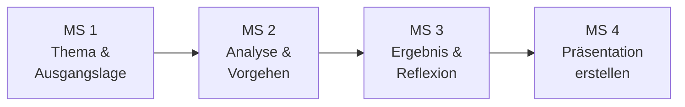

# Meilensteinleitfaden

Dieser Leitfaden begleitet dich in **vier Meilensteinen** von der Themenwahl bis zur fertigen Präsentation. Arbeite jeden Meilenstein der Reihe nach durch.

!!! tip "Eigenes Dokument anlegen"
    Lege dir ein eigenes Dokument an (z. B. Word, Google Docs oder Notion) und beantworte dort die Leitfragen aus jedem Meilenstein. Dieses Dokument wird dein Arbeitsdokument für die gesamte Vorbereitung – und die Grundlage für deine Präsentation in Meilenstein 4.

| Meilenstein | Inhalt | Aufwand |
|---|---|---|
| **1** – Thema & Ausgangslage | Thema, Zielgruppe, Persona, Problemstellung | ca. 30 Min. |
| **2** – Analyse & Vorgehen | Hypothesen, Schritte, Root Cause, Begründung | ca. 45 Min. |
| **3** – Ergebnis & Reflexion | Ergebnis, Nachweise, Lessons Learned, Fachgespräch | ca. 30 Min. |
| **4** – Präsentation erstellen | Folien bauen, Probeläufe, Technik-Check | ca. 45–60 Min. |

---

## Meilenstein 1: Thema, Zielgruppe & Ausgangslage

!!! info "Ziel"
    Du hast dein Thema gewählt, weißt für wen du präsentierst und kannst die Problemstellung klar beschreiben.

### 1.1 Thema wählen

Wähle ein Thema aus dem [Themenpool](themenpool.md). Es sollte ein realer oder realistischer Supportfall sein.

**Beantworte in deinem Dokument:**

- Welches Thema habe ich gewählt?
- Warum dieses Thema? (z. B. eigene Erfahrung, Interesse, Praxisbezug)

### 1.2 Zielgruppe definieren

!!! warning "Wichtig"
    Die Zielgruppe ist **nicht** der Prüfungsausschuss! Nenne eine konkrete Rolle, z. B. IT-Administratoren, IT-Leitung, Fachabteilungsleiter.

**Beantworte in deinem Dokument:**

- An welche Rolle / Position richtet sich meine Präsentation?
- Welches technische Vorwissen hat diese Person? (gering / mittel / hoch)
- Was erwartet diese Person von mir?

### 1.3 Persona erstellen

Beschreibe die Person, die das Support-Problem hat. Das macht dein Szenario greifbar und hilft dir, den Fall lebendig zu präsentieren.

**Beantworte in deinem Dokument:**

- Wie heißt die Person? (fiktiver Name)
- In welcher Abteilung / Rolle arbeitet sie?
- Wie technisch versiert ist sie? (Einsteiger / Fortgeschritten / Experte)
- Wie ist die Stimmung und wie dringend ist das Problem?

### 1.4 Problemstellung beschreiben

**Beantworte in deinem Dokument:**

- Was genau ist passiert? (2–3 Sätze)
- Wie viele Nutzer sind betroffen?
- Welche Auswirkung hat das Problem auf den Betrieb?
- Welche Priorität hat der Fall? (P1–P4) Und warum?

??? tip "Erinnerung: Priorität bestimmen"
    Priorität = **Impact** (Auswirkung) × **Urgency** (Dringlichkeit). Mehr dazu unter [Fehleranalyse](troubleshooting.md).

### Selbstcheck Meilenstein 1

Bevor du weitergehst – hast du alles?

- [ ] Ich habe ein konkretes Thema gewählt
- [ ] Meine Zielgruppe ist eine echte Rolle (nicht „Prüfungsausschuss")
- [ ] Ich kann das Problem in 2–3 Sätzen verständlich erklären
- [ ] Die Priorität ist nachvollziehbar begründet

---

## Meilenstein 2: Analyse & Vorgehen

!!! info "Ziel"
    Du dokumentierst deine systematische Fehleranalyse und kannst dein Vorgehen begründen.

### 2.1 Hypothesen aufstellen

Bevor du loslegst: Was könnten mögliche Ursachen sein? Stelle **mindestens 3 Hypothesen** auf und notiere jeweils, wie du sie prüfen würdest.

**Notiere in deinem Dokument pro Hypothese:**

- Was vermute ich als Ursache?
- Wie kann ich das prüfen? (welches Tool, welcher Befehl, welcher Test?)

??? tip "Erinnerung: Hypothesenbasiertes Troubleshooting"
    Stelle zuerst Vermutungen auf, dann prüfe sie gezielt. Nutze die [Fehleranalyse-Methoden](troubleshooting.md) (OSI-Modell, 5-Why, Divide & Conquer).

### 2.2 Vorgehen dokumentieren

Beschreibe dein Vorgehen **Schritt für Schritt** mit konkreten Tools und Befehlen.

**Notiere in deinem Dokument pro Schritt:**

- Was habe ich getan?
- Welches Tool / welchen Befehl habe ich verwendet?
- Was war das Ergebnis dieses Schritts?

### 2.3 Root Cause benennen

**Beantworte in deinem Dokument:**

- Was war die tatsächliche Ursache des Problems?
- Welche meiner Hypothesen hat sich bestätigt?

### 2.4 Entscheidungen begründen

!!! warning "Prüfer fragen immer: Warum genau SO?"
    Du musst deine Lösung begründen können und mindestens eine Alternative kennen.

**Beantworte in deinem Dokument:**

- Wie lautet meine Lösung?
- Warum habe ich mich für diese Lösung entschieden?
- Welche Alternativen hätte es gegeben? (mindestens eine, mit Vor- und Nachteilen)
- Warum habe ich die Alternative nicht gewählt?

### 2.5 Kommunikation festhalten

**Beantworte in deinem Dokument:**

- Was habe ich beim Erstkontakt gesagt/geschrieben?
- Wie habe ich den Betroffenen auf dem Laufenden gehalten?
- Wie habe ich das Ergebnis kommuniziert?

??? tip "Erinnerung: Gesprächsstruktur"
    Nutze die ACAAA-Methode: Acknowledge → Clarify → Agree → Act → Advise. Mehr unter [Kundenkommunikation](kommunikation.md).

### Selbstcheck Meilenstein 2

- [ ] Ich habe mindestens 3 Hypothesen aufgestellt
- [ ] Mein Vorgehen ist in konkreten Schritten mit Tools/Befehlen dokumentiert
- [ ] Ich kann meine Lösung begründen und kenne mindestens eine Alternative
- [ ] Ich habe beschrieben, wie ich mit dem Betroffenen kommuniziert habe

---

## Meilenstein 3: Ergebnis, Nachweis & Reflexion

!!! info "Ziel"
    Du kannst dein Ergebnis mit Nachweisen belegen und reflektierst, was du gelernt hast.

### 3.1 Ergebnis formulieren

**Beantworte in deinem Dokument:**

- Was ist das konkrete Ergebnis? (z. B. „Der Nutzer kann wieder auf das ERP-System zugreifen")
- Gibt es eine messbare Zeitersparnis oder Wiederherstellungszeit?
- Sind die Betroffenen wieder voll arbeitsfähig?
- Gibt es einen weiteren Nutzen? (z. B. Prozessverbesserung, höhere Sicherheit)

### 3.2 Nachweise planen

Prüfer wollen Beweise sehen. Überlege, welche Nachweise du in deiner Präsentation zeigen kannst:

- Screenshot (z. B. erfolgreicher Test, Konfiguration)
- Log-Auszug (z. B. Event Viewer, Terminal-Output)
- Diagramm (z. B. Netzwerktopologie, Ablaufdiagramm)
- Vorher/Nachher-Vergleich
- Nutzer-Feedback

**Notiere in deinem Dokument:**

- Welche Nachweise werde ich zeigen?
- Beschreibe den wichtigsten Nachweis kurz.

### 3.3 Lessons Learned

**Beantworte in deinem Dokument:**

- Was habe ich aus diesem Supportfall gelernt?
- Was würde ich beim nächsten Mal anders machen?
- Wie lässt sich das Problem in Zukunft verhindern?

### 3.4 Fachgespräch vorbereiten

Nach der Präsentation folgen **5 Minuten Fachgespräch**. Bereite dich auf diese typischen Fragen vor und notiere Antworten in Stichpunkten:

1. Warum haben Sie dieses Vorgehen gewählt?
2. Was wäre Ihre Alternativlösung gewesen?
3. Welche Risiken gab es bei Ihrem Vorgehen?
4. Wie haben Sie die Lösung dokumentiert?
5. Was bedeutet [Fachbegriff aus deinem Thema]?

??? tip "Mehr Übungsfragen"
    Im [Fragenkatalog](../pruefung/fragenkatalog.md) findest du über 55 typische Prüferfragen mit Antwortvorschlägen.

### Selbstcheck Meilenstein 3

- [ ] Mein Ergebnis ist konkret und messbar formuliert
- [ ] Ich habe mindestens einen Nachweis (Screenshot, Log, Diagramm) geplant
- [ ] Ich kann erklären, was ich gelernt habe und was ich anders machen würde
- [ ] Ich habe Antworten auf mindestens 5 typische Prüferfragen vorbereitet

---

## Meilenstein 4: Präsentation erstellen

!!! info "Ziel"
    Du erstellst deine Präsentation auf Basis der Meilensteine 1–3 und übst den Vortrag.

### 4.1 Folien planen

Plane **7–9 Folien** für 10 Minuten. Alle Inhalte hast du bereits in den Meilensteinen 1–3 erarbeitet. Hier ein Vorschlag, welcher Meilenstein welche Folie füllt:

| Folie | Inhalt | Dauer | Quelle |
|---|---|---|---|
| 1 | Titel + Zielgruppe | 30 Sek. | MS 1.1 + 1.2 |
| 2 | Ausgangslage / Problemstellung | 1 Min. | MS 1.3 + 1.4 |
| 3 | Ziel & Umfang | 1 Min. | MS 1.4 |
| 4 | Analyse & Vorgehen (Teil 1) | 1,5 Min. | MS 2.1 + 2.2 |
| 5 | Analyse & Vorgehen (Teil 2) | 1,5 Min. | MS 2.2 + 2.3 |
| 6 | Ergebnis & Nachweis | 1,5 Min. | MS 3.1 + 3.2 |
| 7 | Lessons Learned | 1,5 Min. | MS 3.3 |
| 8 | Zusammenfassung & Abschluss | 1 Min. | MS 3.3 |

??? tip "Kein festes Format vorgeschrieben"
    Die IHK gibt **kein** Folienformat vor. Die Tabelle oben ist eine Orientierungshilfe. Mehr Varianten findest du im [Folienaufbau](praesentationsblueprint.md).

### 4.2 Foliendesign prüfen

Achte beim Erstellen deiner Folien auf diese Punkte:

- Maximal 6 Stichpunkte pro Folie (keine ganzen Sätze!)
- Schriftgröße mindestens 24pt
- Mindestens 1 Diagramm oder Screenshot eingebaut
- Kontrastreiche Farben, gut lesbar bei Bildschirmfreigabe
- Zielgruppe wird auf der ersten Folie genannt

### 4.3 Probeläufe durchführen

Führe **mindestens zwei Probeläufe** durch und notiere in deinem Dokument:

- Datum des Probelaufs
- Wie lange hat der Vortrag gedauert? (Ziel: 10 Minuten)
- Was muss ich anpassen?
- Von wem habe ich Feedback bekommen?

### 4.4 Technik-Check (Prüfungstag)

Gehe vor der Prüfung diese Punkte durch:

- [ ] Laptop geladen / Netzteil angeschlossen
- [ ] Stabile Internetverbindung (LAN bevorzugt)
- [ ] Webcam auf Augenhöhe, Kopf und Oberkörper sichtbar
- [ ] Beleuchtung von vorne, kein Gegenlicht
- [ ] Ruhiger Raum, Handy stumm, Benachrichtigungen aus
- [ ] Bildschirmfreigabe getestet
- [ ] Backup: Präsentation als PDF + in der Cloud
- [ ] 15–20 Minuten vor Beginn im Meeting anwesend

??? tip "Ausführliche Checkliste"
    Eine vollständige Checkliste für den Prüfungstag findest du unter [Checkliste Prüfungstag](../pruefung/checkliste.md).

### Selbstcheck Meilenstein 4

- [ ] Meine Präsentation hat 7–9 Folien
- [ ] Alle Inhalte stammen aus meinen Meilensteinen 1–3
- [ ] Ich habe mindestens 2 Probeläufe gemacht
- [ ] Mein Vortrag dauert ca. 10 Minuten (nicht mehr!)
- [ ] Technik ist geprüft und Backup vorhanden

---

!!! success "Geschafft!"
    Wenn alle vier Meilensteine abgehakt sind, hast du alles erarbeitet und bist bereit für die Prüfung.
