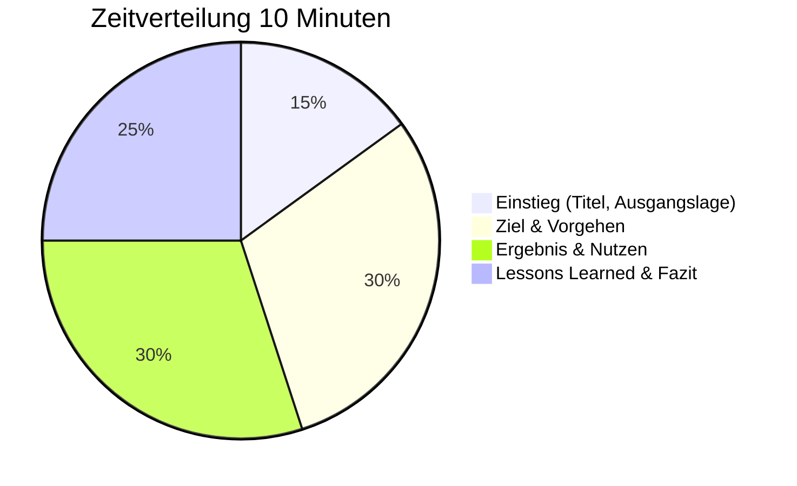

# Folienaufbau

Hier findest du den Standard-Folienplan für deine 10-Minuten-Präsentation. Drei Varianten (Technik, Kommunikation, Mix) und eine Checkliste für die finale Prüfung deiner Folien.

---

## Das Wichtigste

- **7-9 Folien** sind optimal für 10 Minuten
- Pro Folie: **1-1,5 Minuten** Redezeit
- Zielgruppe auf Folie 1 nennen (oder mündlich vor Start)
- Ergebnis mit Nutzen muss auf jeden Fall rein
- Keine Textwände – Schlagworte und Visuals nutzen
- **Online-Prüfung:** Bildschirmfreigabe vorbereiten, Folien gut lesbar gestalten

---

## Standard-Folienplan (8 Folien)

| Folie | Titel | Zeit | Inhalt |
|-------|-------|------|--------|
| 1 | Titel + Zielgruppe | 0:30 | Thema, dein Name, Zielgruppe nennen |
| 2 | Ausgangslage | 1:00 | Problem, Impact, wer war betroffen |
| 3 | Ziel & Scope | 1:00 | Was wollte ich erreichen? Abgrenzung |
| 4 | Vorgehen (Teil 1) | 1:30 | Analyse, erste Schritte, Hypothesen |
| 5 | Vorgehen (Teil 2) | 1:30 | Durchführung, Entscheidungen |
| 6 | Ergebnis | 1:30 | Was wurde erreicht? Nachweis, Nutzen |
| 7 | Lessons Learned | 1:30 | Was würde ich anders machen? Risiken |
| 8 | Zusammenfassung | 1:00 | Kernaussagen, Ausblick, Dank |
| | **Gesamt** | **10:00** | |

---

## Variante A: Technik-Fokus

Für technische Troubleshooting-Cases (DNS, Client-Problem, Security-Incident).

```
┌─────────────────────────────────────────────────────────────────┐
│ Folie 1: Titel + Zielgruppe (0:30)                              │
│   → Name, Thema, „Meine Zielgruppe sind IT-Administratoren"     │
├─────────────────────────────────────────────────────────────────┤
│ Folie 2: Incident-Beschreibung (1:00)                           │
│   → Was war das Problem? Symptome, Impact, Dringlichkeit        │
│   → Artefakt: Ticket-Auszug oder Fehlermeldung                  │
├─────────────────────────────────────────────────────────────────┤
│ Folie 3: Analyse-Ansatz (1:00)                                  │
│   → Welche Hypothesen? Welche Diagnoseschritte?                 │
│   → Artefakt: Diagnose-Workflow oder OSI-Layer-Zuordnung        │
├─────────────────────────────────────────────────────────────────┤
│ Folie 4: Troubleshooting (1:30)                                 │
│   → Konkrete Schritte, Tools, Befehle                           │
│   → Artefakt: Log-Auszug, Ping/nslookup-Output                  │
├─────────────────────────────────────────────────────────────────┤
│ Folie 5: Root Cause + Lösung (1:30)                             │
│   → Ursache gefunden, Entscheidung für Lösung                   │
│   → Artefakt: Konfigurationsänderung, Fix-Nachweis              │
├─────────────────────────────────────────────────────────────────┤
│ Folie 6: Ergebnis + Validierung (1:30)                          │
│   → Problem gelöst, Nachweis (Vorher/Nachher)                   │
│   → Artefakt: Erfolgstest, Ticket-Abschluss                     │
├─────────────────────────────────────────────────────────────────┤
│ Folie 7: Dokumentation + Prävention (1:00)                      │
│   → Was wurde dokumentiert? Wie wird Wiederholung verhindert?   │
│   → Artefakt: Knowledge-Base-Eintrag, Monitoring-Alert          │
├─────────────────────────────────────────────────────────────────┤
│ Folie 8: Fazit + Q&A-Überleitung (1:00)                         │
│   → Kernaussagen, „Ich freue mich auf Ihre Fragen"              │
└─────────────────────────────────────────────────────────────────┘
```

---

## Variante B: Kommunikation-Fokus

Für Cases mit Schwerpunkt Kundenkommunikation, Eskalation, Service Recovery.

```
┌─────────────────────────────────────────────────────────────────┐
│ Folie 1: Titel + Zielgruppe (0:30)                              │
│   → „Meine Zielgruppe ist das Service-Management"               │
├─────────────────────────────────────────────────────────────────┤
│ Folie 2: Ausgangssituation (1:00)                               │
│   → Was war passiert? Wer war betroffen? Emotionslage?          │
│   → Artefakt: Anonymisierte Beschwerde oder Eskalationsmail     │
├─────────────────────────────────────────────────────────────────┤
│ Folie 3: Herausforderung (1:00)                                 │
│   → Was machte den Fall schwierig? Zeitdruck, VIP, History?     │
│   → Artefakt: Timeline, Stakeholder-Übersicht                   │
├─────────────────────────────────────────────────────────────────┤
│ Folie 4: Kommunikationsstrategie (1:30)                         │
│   → Wie bin ich vorgegangen? Gesprächsstruktur, Deeskalation    │
│   → Artefakt: Gesprächsleitfaden, Kommunikationsmodell          │
├─────────────────────────────────────────────────────────────────┤
│ Folie 5: Umsetzung (1:30)                                       │
│   → Konkrete Gespräche, Maßnahmen, Abstimmungen                 │
│   → Artefakt: Protokollauszug, Maßnahmenplan                    │
├─────────────────────────────────────────────────────────────────┤
│ Folie 6: Ergebnis (1:30)                                        │
│   → Situation entschärft, Kundenbeziehung stabilisiert          │
│   → Artefakt: Feedback, Follow-up-Status                        │
├─────────────────────────────────────────────────────────────────┤
│ Folie 7: Lessons Learned (1:00)                                 │
│   → Was habe ich gelernt? Was würde ich anders machen?          │
│   → Artefakt: Prozessverbesserung, Eskalationsmatrix            │
├─────────────────────────────────────────────────────────────────┤
│ Folie 8: Fazit + Q&A-Überleitung (1:00)                         │
│   → Kernaussagen zur Servicekommunikation                       │
└─────────────────────────────────────────────────────────────────┘
```

---

## Variante C: Mix-Fokus (empfohlen)

Für Cases, die technische Kompetenz und Kommunikation verbinden.

```
┌─────────────────────────────────────────────────────────────────┐
│ Folie 1: Titel + Zielgruppe (0:30)                              │
│   → „Meine Zielgruppe ist die IT-Leitung"                       │
├─────────────────────────────────────────────────────────────────┤
│ Folie 2: Ausgangslage (1:00)                                    │
│   → Technisches Problem + betroffene User + Business Impact     │
│   → Artefakt: Ticket mit Impact-Beschreibung                    │
├─────────────────────────────────────────────────────────────────┤
│ Folie 3: Ziel + Scope (0:45)                                    │
│   → Technisches Ziel + Kommunikationsziel                       │
│   → Artefakt: Erfolgskriterien-Liste                            │
├─────────────────────────────────────────────────────────────────┤
│ Folie 4: Technische Analyse (1:30)                              │
│   → Diagnose, Hypothesen, Troubleshooting-Schritte              │
│   → Artefakt: Diagnose-Output, Log-Auszug                       │
├─────────────────────────────────────────────────────────────────┤
│ Folie 5: User-Kommunikation (1:15)                              │
│   → Wie habe ich den User informiert? Erwartungsmanagement      │
│   → Artefakt: Kommunikationsbeispiel, Status-Update             │
├─────────────────────────────────────────────────────────────────┤
│ Folie 6: Lösung + Entscheidung (1:30)                           │
│   → Lösung implementiert, Option A vs. B begründet              │
│   → Artefakt: Konfiguration, Entscheidungsmatrix                │
├─────────────────────────────────────────────────────────────────┤
│ Folie 7: Ergebnis (1:30)                                        │
│   → Technisch gelöst + User zufrieden + Dokumentiert            │
│   → Artefakt: Erfolgsnachweise, Feedback                        │
├─────────────────────────────────────────────────────────────────┤
│ Folie 8: Fazit + Lessons Learned (1:00)                         │
│   → Zusammenfassung, Prävention, Ausblick                       │
└─────────────────────────────────────────────────────────────────┘
```

---

## Zeitverteilung



---

## Checkliste: Folien prüfen

### Timing

- [ ] Generalprobe mit Stoppuhr gemacht?
- [ ] **Online-Generalprobe:** Mit Bildschirmfreigabe geübt?
- [ ] Jede Folie in 1-1,5 Minuten besprechbar?
- [ ] Puffer für Versprecher eingeplant?

### Story & Struktur

- [ ] Zielgruppe genannt (Folie 1 oder mündlich)?
- [ ] Problem → Vorgehen → Ergebnis erkennbar?
- [ ] Roter Faden durchgängig?
- [ ] Keine inhaltlichen Sprünge?

### Visuals (wichtig für Online-Präsentation!)

- [ ] Keine Textwände (max. 6 Bulletpoints pro Folie)?
- [ ] Schriftgröße lesbar (mind. 24pt – bei Bildschirmfreigabe wirkt alles kleiner!)
- [ ] Mindestens 1 Diagramm/Screenshot?
- [ ] Farben kontrastreich (Kompression bei Video kann Kontraste reduzieren)?
- [ ] Folien im 16:9-Format (passt besser für Bildschirmfreigabe)?

### Begriffe & Tiefe

- [ ] Fachbegriffe verwendet, die du erklären kannst?
- [ ] Mindestens 1 Entscheidung begründet?
- [ ] Mindestens 1 Alternative genannt?

### Ergebnissicherung

- [ ] Messbares Ergebnis auf Folie?
- [ ] Nutzen für Zielgruppe klar?
- [ ] Dokumentation/Follow-up erwähnt?

---

## Artefakte: Was zeigen?

| Artefakt-Typ | Beispiele | Hinweis |
|--------------|-----------|---------|
| **Screenshot** | Ticket, Fehlermeldung, Tool-Output | Persönliche Daten schwärzen |
| **Log-Auszug** | Event-Log, Command-Output | Nur relevante Zeilen, formatiert |
| **Diagramm** | Workflow, Netzwerkskizze, Timeline | Selbst erstellt oder aus Tool |
| **Tabelle** | Entscheidungsmatrix, Vergleich | Übersichtlich halten |
| **Konfiguration** | GPO, Policy, Skript-Auszug | Kommentiert, nicht zu lang |

!!! warning "Wichtig"
    Artefakte unterstützen deine Story – sie ersetzen sie nicht. Zeige sie kurz und erkläre, was man sieht.

!!! tip "Online-Tipp"
    Bei Bildschirmfreigabe können Details schwer erkennbar sein. Vergrößere wichtige Bereiche in Screenshots oder markiere sie farbig. Teste die Lesbarkeit vorher in einer Probe-Videokonferenz!

