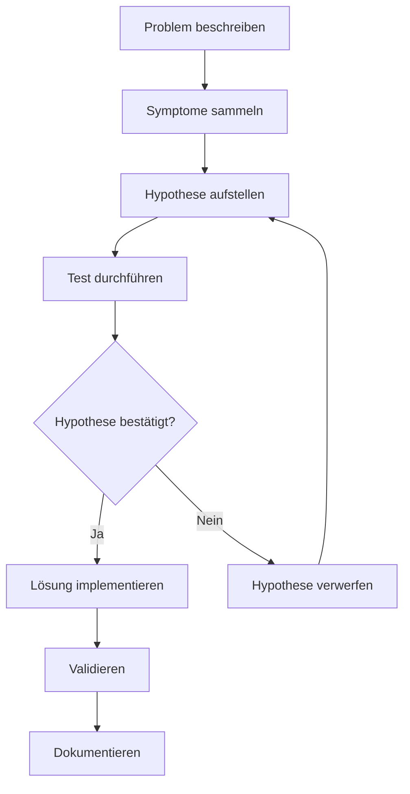

# Fehleranalyse

Hier findest du Methoden für systematische Fehleranalyse. Damit zeigst du in der Präsentation und im Fachgespräch, dass du strukturiert arbeitest.

---

## Das Wichtigste

- Troubleshooting ist **kein Raten** – es folgt einem System
- **Hypothese → Test → Ergebnis → Nächster Schritt**
- OSI-Modell hilft bei Netzwerkproblemen (unten anfangen)
- Ticket-Triage: **Impact × Urgency = Priority**
- Dokumentiere alles: Repro, Logs, Fix, Prävention

---

## Methode 1: Hypothesenbasiertes Troubleshooting

### So wendest du es an:

| Schritt | Frage | Beispiel |
|---------|-------|----------|
| 1. Problem | Was genau funktioniert nicht? | „User kann E-Mails nicht senden" |
| 2. Symptome | Was sehe/höre ich? Fehlermeldung? | „Timeout-Fehler nach 30 Sekunden" |
| 3. Hypothese | Was könnte die Ursache sein? | „Mailserver nicht erreichbar" |
| 4. Test | Wie prüfe ich das? | Ping, Telnet Port 25, nslookup MX |
| 5. Ergebnis | Was sagt der Test? | „Ping funktioniert, Port 25 blockiert" |
| 6. Nächster Schritt | Lösung oder neue Hypothese? | „Firewall-Regel prüfen" |

---

## Methode 2: Teile und Herrsche

Teile das System in Komponenten und isoliere das Problem.

**Schritt 1:** Status erfassen

| Client | Netzwerk | Server | Dienst |
|--------|----------|--------|--------|
| OK | ? Unklar | ? Unklar | ? Unklar |

**Schritt 2:** Netzwerk testen (Ergebnis: OK)

| Client | Netzwerk | Server | Dienst |
|--------|----------|--------|--------|
| OK | OK | ? Unklar | ? Unklar |

**Schritt 3:** Server testen, dann Dienst eingrenzen

!!! tip "Prinzip"
    Halbiere das System, teste die Mitte, grenze ein.

---

## OSI-Modell für Netzwerk-Fehlersuche

Beginne bei Layer 1 (physisch) und arbeite dich nach oben.

| Layer | Name | Typische Prüfungen | Tools/Befehle |
|-------|------|-------------------|---------------|
| 1 | Physical | Kabel, LEDs, Verbindung | Sichtprüfung, Kabeltester |
| 2 | Data Link | MAC, Switch-Port, VLAN | `arp -a`, Switch-Config |
| 3 | Network | IP, Routing, Firewall | `ping`, `tracert`, `ipconfig` |
| 4 | Transport | Ports, TCP/UDP | `netstat`, `telnet`, `Test-NetConnection` |
| 5-7 | Application | Dienst, Authentifizierung | Service-Status, Logs |

### Typischer Ablauf bei „Kein Netzwerk"

| Schritt | Prüfung | Layer |
|---------|---------|-------|
| 1 | Kabel drin? LED an? | Layer 1 |
| 2 | IP-Adresse vorhanden? DHCP OK? | Layer 3 |
| 3 | Gateway erreichbar? (ping) | Layer 3 |
| 4 | DNS funktioniert? (nslookup) | Layer 7 |
| 5 | Zielserver erreichbar? (ping hostname) | Layer 3 |
| 6 | Dienst auf Zielport erreichbar? | Layer 4 |

---

## Ursachenanalyse

### Methode 1: 5-Why

Frage 5x „Warum?", um zur Ursache zu kommen.

| Iteration | Frage | Antwort |
|-----------|-------|---------|
| 1 | Warum konnte der User nicht drucken? | Drucker war offline |
| 2 | Warum war der Drucker offline? | IP-Adresse hatte sich geändert |
| 3 | Warum hatte sich die IP geändert? | DHCP-Lease war abgelaufen |
| 4 | Warum gab es keine Reservierung? | Drucker war nicht im DHCP reserviert |
| 5 | Warum war er nicht reserviert? | Kein Prozess für Drucker-Onboarding |

!!! success "Root Cause"
    Fehlender Prozess → **Maßnahme:** DHCP-Reservierung für alle Drucker

### Methode 2: Known Good Comparison

Vergleiche das fehlerhafte System mit einem funktionierenden.

| Aspekt | Defektes System | Funktionierendes System | Unterschied? |
|--------|-----------------|------------------------|--------------|
| IP-Adresse | 192.168.1.150 | 192.168.1.100 | Anderes Subnet? Nein |
| DNS-Server | 192.168.1.1 | 192.168.1.10 | **Ja – falscher DNS!** |
| Gateway | 192.168.1.1 | 192.168.1.1 | Nein |

### Methode 3: Ishikawa (Fischgräte) – vereinfacht

Für komplexere Probleme mit mehreren möglichen Ursachen:

| Kategorie | Mögliche Ursachen |
|-----------|-------------------|
| **Mensch** | Falsches Passwort? Fehlende Berechtigungen? |
| **Maschine** | Server down? Netzwerk-Problem? |
| **Methode** | Falscher Pfad? Vererbung falsch? |
| **Material** | Dateien gelöscht? Verschlüsselt? |

**Beispiel-Problem:** User kann nicht auf Share zugreifen

---

## Ticket-Priorisierung

### Definitionen

| Begriff | Bedeutung | Beispiel |
|---------|-----------|----------|
| **Impact** | Wie viele User/Systeme betroffen? | 1 User, Team, Abteilung, Firma |
| **Urgency** | Wie dringend ist eine Lösung? | Workaround möglich? Deadline? |
| **Priority** | Reihenfolge der Bearbeitung | P1 (kritisch) bis P4 (gering) |

### Priority-Matrix

|  | **Urgency: Hoch** | **Urgency: Mittel** | **Urgency: Niedrig** |
|--|-------------------|---------------------|----------------------|
| **Impact: Hoch** | P1 – Kritisch | P2 – Hoch | P3 – Mittel |
| **Impact: Mittel** | P2 – Hoch | P3 – Mittel | P4 – Gering |
| **Impact: Niedrig** | P3 – Mittel | P4 – Gering | P4 – Gering |

### Typische Reaktionszeiten (Beispiel)

| Priority | Erste Reaktion | Ziel-Lösung |
|----------|---------------|-------------|
| P1 | 15 Minuten | 4 Stunden |
| P2 | 1 Stunde | 8 Stunden |
| P3 | 4 Stunden | 24 Stunden |
| P4 | 8 Stunden | 72 Stunden |

---

## Eskalation: Wann und wie?

### Funktionale Eskalation (Fachlich)
→ An Spezialisten mit mehr Know-how

**Wann:** Du kommst nicht weiter, brauchst tiefere Expertise

### Hierarchische Eskalation (Management)
→ An Vorgesetzte für Ressourcen/Entscheidungen

**Wann:**

- SLA-Verletzung droht
- Politische Entscheidung nötig
- Ressourcen fehlen

### Eskalations-Checkliste

- [ ] Problem klar dokumentiert (was, wann, wer betroffen)
- [ ] Bisherige Maßnahmen aufgelistet
- [ ] Impact und Dringlichkeit bewertet
- [ ] Erwartung an Eskalationsziel formuliert
- [ ] Übergabe an nächste Ebene sauber dokumentiert

---

## Dokumentation: Was muss ins Ticket?

### Minimum-Standard

| Feld | Inhalt |
|------|--------|
| **Symptom** | Was genau funktioniert nicht? |
| **Reproduktion** | Wie kann man das Problem nachstellen? |
| **Betroffene** | User, Systeme, Standort |
| **Diagnose** | Was wurde geprüft? Ergebnisse? |
| **Root Cause** | Was war die Ursache? |
| **Fix** | Was wurde gemacht? |
| **Validierung** | Wie wurde geprüft, dass es funktioniert? |
| **Prävention** | Was verhindert Wiederholung? |

### Beispiel-Dokumentation

| Feld | Dokumentation |
|------|---------------|
| **Symptom** | User Müller kann nicht auf \\\\server\\share zugreifen |
| **Repro** | Zugriff über Explorer, Fehlermeldung „Zugriff verweigert" |
| **Betroffene** | 1 User, Buchhaltung |
| **Diagnose** | NTFS-Rechte geprüft: User nicht in Gruppe. Share-Rechte OK. Konto nicht gesperrt. |
| **Root Cause** | User fehlte in AD-Gruppe „Buchhaltung" |
| **Fix** | User zur AD-Gruppe hinzugefügt, gpupdate /force |
| **Validierung** | User kann jetzt auf Share zugreifen |
| **Prävention** | Onboarding-Checkliste um Gruppenzuweisung ergänzt |

---

## Wichtige Befehle und Tools

### Windows

| Zweck | Befehl/Tool |
|-------|-------------|
| IP-Konfiguration | `ipconfig /all` |
| DNS-Auflösung | `nslookup hostname` |
| Erreichbarkeit | `ping IP/hostname` |
| Route | `tracert hostname` |
| Ports | `netstat -an`, `Test-NetConnection -Port` |
| Dienste | `services.msc`, `Get-Service` |
| Event-Logs | `eventvwr.msc`, `Get-EventLog` |
| Gruppenrichtlinien | `gpresult /r`, `rsop.msc` |
| Benutzerinfo | `whoami /all`, `net user` |

### Linux

| Zweck | Befehl |
|-------|--------|
| IP-Konfiguration | `ip a`, `ifconfig` |
| DNS-Auflösung | `nslookup`, `dig`, `host` |
| Erreichbarkeit | `ping` |
| Route | `traceroute` |
| Ports | `ss -tuln`, `netstat -tuln` |
| Dienste | `systemctl status`, `service --status-all` |
| Logs | `journalctl`, `/var/log/` |

### Netzwerk allgemein

| Zweck | Tool |
|-------|------|
| Paketanalyse | Wireshark |
| Port-Scan | nmap |
| SSL/TLS prüfen | openssl s_client |
| HTTP-Requests | curl, wget |

